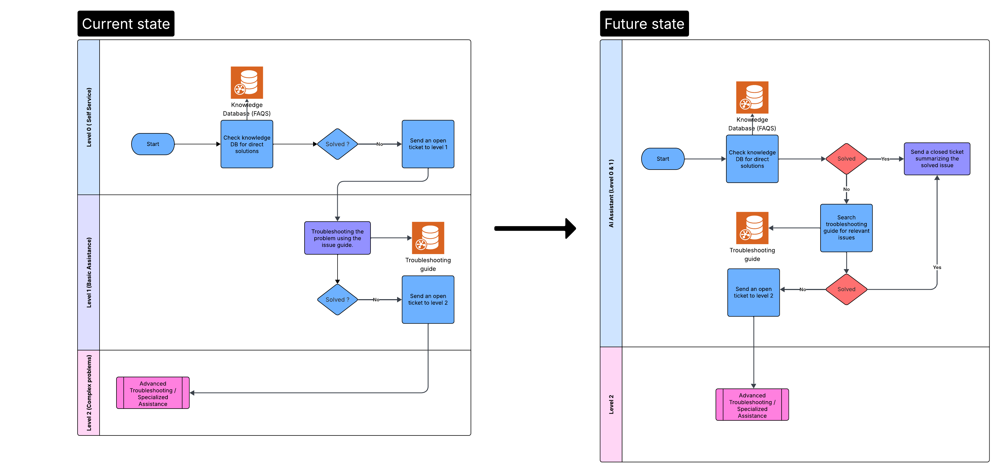
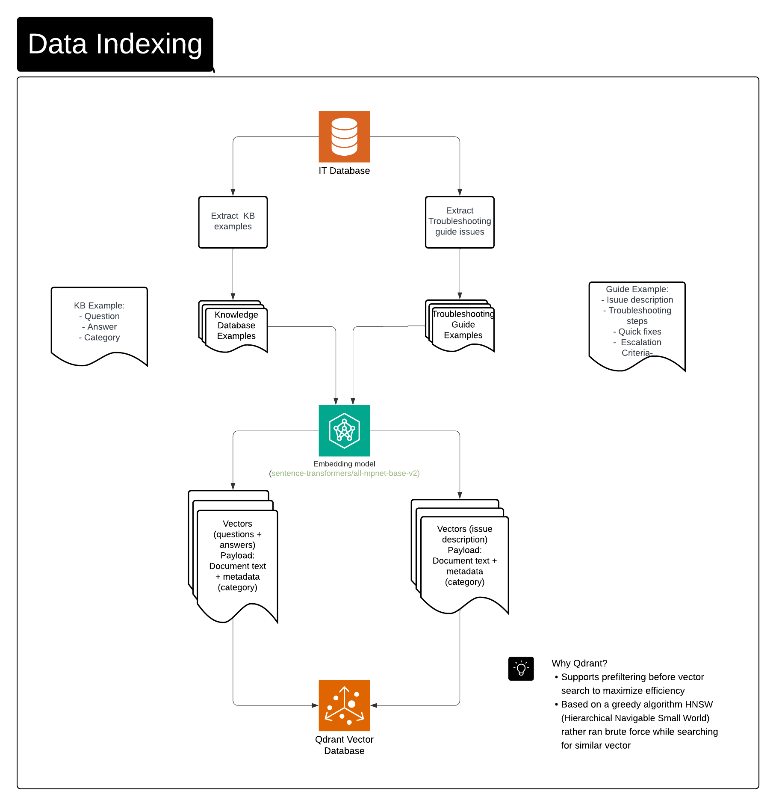
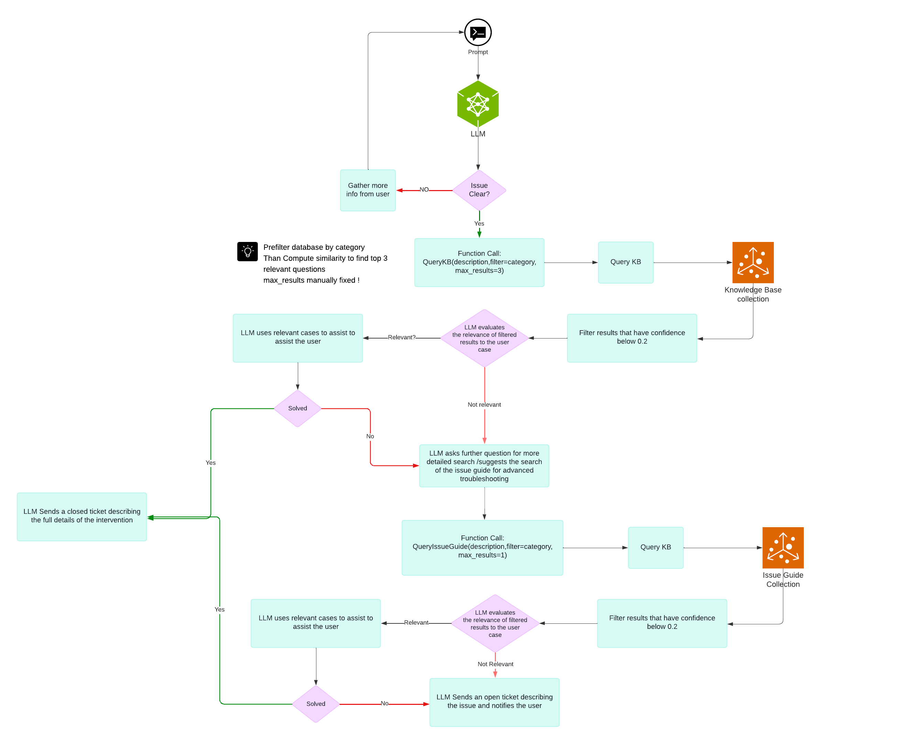

# IT Support Agent

## Project Overview

**IT Support Agent** is an AI-powered virtual assistant designed to help people **solve technical problems on their devices or software**. It provides step-by-step troubleshooting guidance, automated diagnostics, and ticket management when issues cannot be resolved automatically.

### Key Features
- **Natural language support:** users describe their problem in plain language.  
- **Knowledge-base search:** quickly suggests solutions.  
- **Guided diagnostics:** asks structured questions for complex issues.  
- **Ticket creation & escalation:** for unresolved problems.  
- **LLM integration:** uses Hugging Face models for intelligent responses.

### Target Users
- Individuals facing technical problems with computers, printers, software, or devices.  
- People who need structured, step-by-step IT support without waiting for a human technician.

### Purpose
The project aims to **reduce frustration, speed up problem resolution, and provide a virtual IT support experience** for everyday users.
## Business Logic & Workflow

The IT Support Agent is designed to streamline technical problem resolution through a multi-level workflow:

### Current State
1. **Level 0 (Self-service)**  
   - User starts by checking the **Knowledge Database (FAQs)** for direct solutions.  
   - If the problem is solved, the process ends.  
   - If not, an **open ticket is sent to Level 1**.

2. **Level 1 (Basic Assistance)**  
   - Troubleshooting is guided using the **issue guide**.  
   - If the issue is resolved, the ticket is closed.  
   - If not, the ticket escalates to **Level 2**.

3. **Level 2 (Complex Problems)**  
   - Advanced troubleshooting or specialized human assistance resolves the problem.  

---

### Future State (AI-Enhanced)
- The **AI Assistant (Level 0 & 1)** integrates knowledge database search and issue guide in a single workflow:
  1. User query is first checked against the **Knowledge Database (FAQs)**.
     - If solved, a **closed ticket** is automatically generated summarizing the solution.
  2. If unresolved, the AI searches the **Troubleshooting Guide** for relevant solutions.
     - If a solution is found, a **closed ticket** is generated.
     - Otherwise, an **open ticket is sent to Level 2** for advanced support.

- **Level 2 (Complex Problems)** remains unchanged, handling advanced or specialized assistance.

### Key Advantages
- **Reduced resolution time** by automating Level 0 and Level 1 support.  
- **Closed tickets for successfully solved issues** improve reporting and tracking.  
- **Seamless escalation** for complex problems ensures no issue is left unresolved.  
- **AI-driven guidance** provides more consistent and accurate solutions than manual troubleshooting alone.

## Data Indexing Workflow

This diagram shows how IT knowledge and troubleshooting data are processed and stored for efficient retrieval using **vector search**.

### Steps:

1. **Data Extraction**
   - **Knowledge Base Examples**: Extract **questions**, **answers**, and **categories**.
   - **Troubleshooting Guide Examples**: Extract **issue descriptions**, **troubleshooting steps**, **quick fixes**, and **escalation criteria**.

2. **Embedding Generation**
   - Use **`sentence-transformers/all-mpnet-base-v2`** to convert text into dense vectors.
   - Each vector contains:
     - Document text (questions, answers, or issue descriptions)
     - Metadata (e.g., category, payload)

3. **Vector Storage in Qdrant**
   - Vectors are stored in **Qdrant Vector Database**.
   - Qdrant uses **HNSW (Hierarchical Navigable Small World)** for fast and efficient similarity search.

---

### Why Qdrant?
- Supports **prefiltering before vector search** to maximize efficiency
- Uses a **graph-based HNSW algorithm** for high performance (better than brute-force search)

## Full Agent Workflow

This section describes the **complete operational flow** of the IT Support Agent, integrating the Knowledge Base (KB), Troubleshooting Guide, and Ticketing System into one seamless process.

### Workflow Diagram

### Workflow Explanation

1. **User Interaction (Prompt Input)**  
   - The process begins when a user reports an issue in natural language.

2. **Issue Clarity Check**  
   - The LLM determines whether the issue description is clear.  
   - **If unclear:** The LLM gathers more information from the user.  
   - **If clear:** It proceeds to search the Knowledge Base.

3. **Knowledge Base Search**  
   - Function call: `QueryKB(description, filter=category, max_results=3)`  
   - The system prefilters the database by category, then computes similarity to find the top 3 relevant questions.  
   - Results with a confidence score below **0.2** are filtered out.

4. **Result Evaluation**  
   - The LLM evaluates whether the retrieved cases are relevant to the user’s issue.  
   - **If relevant:** The LLM uses these cases to assist the user.  
     - If resolved → A **closed ticket** is generated with full intervention details.  
   - **If not relevant:** The LLM requests more detailed information or suggests searching the Issue Guide.

5. **Issue Guide Search (Advanced Troubleshooting)**  
   - Function call: `QueryIssueGuide(description, filter=category, max_results=1)`  
   - Similar filtering and confidence scoring are applied.  
   - If results are relevant → The LLM assists the user using the guide.  
     - If resolved → Closed ticket is created.  
   - If not resolved → An **open ticket** is generated and escalated for human intervention.

6. **Ticket Handling**  
   - **Closed ticket:** Includes the full details of the intervention and resolution steps.  
   - **Open ticket:** Includes a summary of the problem and the attempted solutions before escalation.

### Key Features of the Full Agent Workflow

- **Layered Resolution Process:** Starts with Knowledge Base, moves to Issue Guide, then escalates if needed.  
- **Confidence-based Filtering:** Prevents irrelevant or low-confidence answers from being shown.  
- **Automated Ticket Management:** Automatically generates closed tickets for solved cases and open tickets for unresolved ones.  
- **Adaptive Questioning:** If initial results fail, the LLM asks targeted questions to refine the search.  

